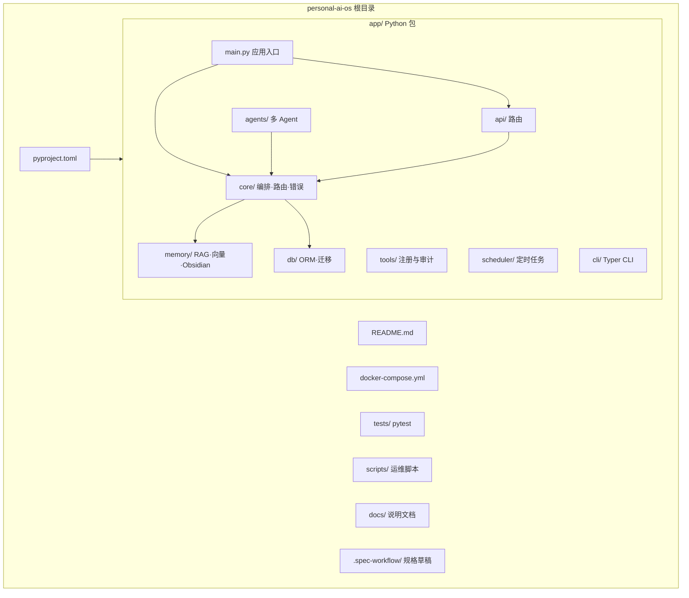

# Personal AI OS — AI 上下文索引

> 由 `/init-project` 生成/更新 · `2026-05-04 11:34:33`

## 愿景与定位

**personal-ai-os** 是一套**本地优先**、模块化、可对接 Open WebUI / AnythingLLM 的 Personal AI OS **模板**。目标能力包括：多接入点（API、CLI、Webhook、Scheduler）、多 Session（`user_id` / `project_id` / `session_id`）、多 Agent 编排、PostgreSQL + Qdrant + Obsidian 长期记忆，以及面向 OpenAI 兼容端点的模型路由与 RAG。

## 架构总览

- **入口**：`app.main:app`（FastAPI），生命周期内初始化数据库与 APScheduler。
- **HTTP**：各功能域路由挂载在 `app/api/routes_*.py`；内部错误与 OpenAI 兼容错误格式见 README「服务化运行约定」。
- **编排**：`app/core/orchestrator.py` 连接 `ModelRouter` 与 `Retriever`；多 Agent 工作流在 `app/agents/`。
- **数据**：SQLAlchemy + PostgreSQL（模型与迁移 `app/db/`）；向量检索 Qdrant（`app/memory/vector_store.py` 等）；Obsidian 写入与记忆流水线在 `app/memory/`。
- **运维**：`docker-compose.yml` 提供 api、postgres、qdrant、open-webui；配置通过 `.env` / `app/config.py`（`pydantic-settings`）。

## 仓库结构（Mermaid）

## 模块索引

| 路径 | 职责摘要 | 本地文档 |
|------|----------|----------|
| `app/` | 应用包总览与子模块导航 | [app/CLAUDE.md](app/CLAUDE.md) |
| `app/api/` | FastAPI 路由：chat、memory、sessions、agents、OpenAI 兼容、诊断、工具等 | [app/api/CLAUDE.md](app/api/CLAUDE.md) |
| `app/agents/` | Planner / Executor / Workflow、run 存储 | [app/agents/CLAUDE.md](app/agents/CLAUDE.md) |
| `app/core/` | Orchestrator、ModelRouter、会话身份、错误与请求上下文、诊断 | [app/core/CLAUDE.md](app/core/CLAUDE.md) |
| `app/db/` | `database`、SQLAlchemy 模型、版本化迁移 | [app/db/CLAUDE.md](app/db/CLAUDE.md) |
| `app/memory/` | 检索、向量库、嵌入、Obsidian、记忆流水线、检索质量 | [app/memory/CLAUDE.md](app/memory/CLAUDE.md) |
| `app/tools/` | 工具注册、shell/file/git 等实现与审计 | [app/tools/CLAUDE.md](app/tools/CLAUDE.md) |
| `app/scheduler/` | APScheduler 集成与 jobs | [app/scheduler/CLAUDE.md](app/scheduler/CLAUDE.md) |
| `app/cli/` | 调用本地 HTTP API 的 Typer CLI | [app/cli/CLAUDE.md](app/cli/CLAUDE.md) |
| `tests/` | `pytest`，含 `integration` 标记 | [tests/CLAUDE.md](tests/CLAUDE.md) |
| `scripts/` | 迁移、运行时检查、检索评估等 | [scripts/CLAUDE.md](scripts/CLAUDE.md) |
| `docs/` | 路线图、测试与开源就绪等 | [docs/CLAUDE.md](docs/CLAUDE.md) |

## 全局规范

- **语言与包**：Python ≥ 3.11；包发现 `app*`（见 `pyproject.toml`）。
- **测试**：`pytest`，配置 `[tool.pytest.ini_options]`；集成测试使用 `@pytest.mark.integration`。
- **配置**：禁止提交密钥；本地默认值可能导致 `degraded` 诊断，发布前用 `scripts/check_runtime_config.py --strict`。
- **迁移**：`scripts/run_migrations.py`；版本文件在 `app/db/migrations/versions/`。

## 初始化扫描覆盖率（本轮）

- **已扫描文件数 / 估算源码规模**：对仓库内 **83** 个 `*.py` 文件（`rg` 统计，含 `app/`、`tests/`、`scripts/` 等）建立索引联系；全仓非 `.git` 文件总数未完整枚举（含大量 Git 对象时不计入「业务源码」）。
- **已覆盖模块占比**：下表所列 **12** 个子路径均写入/更新 `CLAUDE.md`，视为模块文档 **100%** 覆盖（按本模板定义的模块边界）。
- **缺口**：未对 `.spec-workflow/` 下各 spec 逐份摘要；未逐行审阅全部业务 `.py`。数据目录 `data/` 中的用户内容默认不纳入索引说明。

**建议下一步深挖**：`app/memory/retrieval_quality.py` 与 `app/core/model_router.py`（提供商与降级策略）；`app/agents/workflow.py`（多 Agent 边界）；`app/db/migrations/versions/` 与 `app/db/models.py` 一致性。
