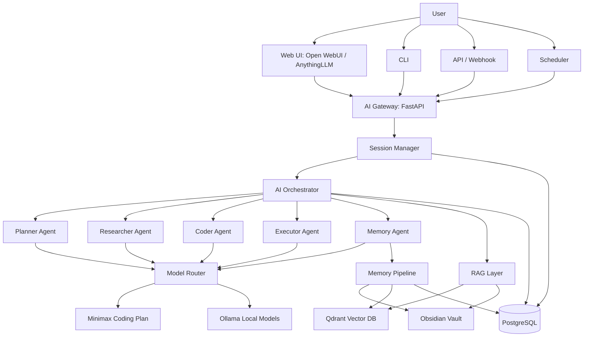

# Personal AI OS Template

本模板用于初始化一套本地优先、开源免费、模块化的 Personal AI OS。

能力目标：

- 多接入点：API、CLI、Webhook、Scheduler，可接 Open WebUI / AnythingLLM
- 多 Session：`user_id / project_id / session_id`
- 多 Agent：Planner / Researcher / Coder / Executor / Memory
- 长期记忆：PostgreSQL + Qdrant + Obsidian
- RAG：从历史记忆和 Obsidian 检索上下文
- 模型接入：Minimax Coding Plan / Ollama / OpenAI-compatible API

## 当前项目进度

当前仓库定位是可克隆、可二次开发的 Personal AI OS 模板，不是面向最终用户的一体化产品。当前阶段已经完成本地运行、Open WebUI 接入、长期记忆基础闭环、P0/P1/P2/P3 基础版、P4/N-series 收口任务、开源工程化、GitHub CI 发布入口，以及模块 95% 提升第一轮收口。

按完整 Personal AI OS 愿景估算，整体进度约为 90%。按当前阶段目标“可本地长期运行、可开源协作、基础服务可信、工具调用可控可审计、最小 Agent 闭环可验证”估算，进度约为 100%。

| 模块 | 当前状态 | 摘要 |
| --- | --- | --- |
| 本地服务底座 | 已完成基础版 | FastAPI、PostgreSQL、Qdrant、Open WebUI、Scheduler 可通过 Docker Compose 运行 |
| OpenAI-compatible 接入 | 已完成 95% 模板版 | `/v1/models`、`/v1/chat/completions`、流式响应、metadata 身份语义，非流式响应提供稳定 usage 估算 |
| 长期记忆 | 已完成 95% 模板版 | DB、Qdrant、Obsidian 写入，支持 update-or-create、检索失败降级和 Qdrant payload 治理 metadata |
| 检索质量评估 | 已完成规格收尾 | 已有离线 fixture 和 Qdrant 端到端评估脚本，支持命中率阈值、稳定 JSON schema 和失败退出码 |
| Tool Registry | 已完成 N4 写工具白名单 | `file.read_text`、`file.write_text`、`obsidian.append_note`、`git.status`、`shell.run_safe`，带 HTTP/MCP adapter 和 ToolRun 审计 |
| Agent Workflow | 已完成 95% 模板版 | `/agents/run` 和兼容 `/task` 统一走 AgentWorkflow；默认 deterministic Planner 保持兼容，`planner_mode=model` 支持模型生成 JSON plan，并强制 schema 校验、DAG 条件跳过、fail-fast、AgentRun 审计；Researcher/Coder/Memory Agent 已具备基础结构化能力 |
| Obsidian 同步 | 已完成双向同步基础版 | 支持 dry-run、vault/DB 双向更新、冲突报告、默认非破坏性删除策略和 sync state |
| Scheduler | 已完成 95% 模板版 | 支持每日摘要任务和 `/scheduler/status` 只读运行状态 |
| CLI | 已完成 95% 模板版 | 支持 chat、memory search、Obsidian import、`agents run`、`agents runs`、JSON 输出和非 2xx 错误码 |
| 数据库迁移 | 已完成 N10 | Docker API 启动前执行 migration；服务启动时缺少 required tables 会明确失败 |
| 开源工程化 | 已完成基础版 | Apache-2.0、SECURITY、CODE_OF_CONDUCT、package metadata、GitHub Actions CI/smoke |

模块 95% 提升 SPEC 和计划见 `docs/superpowers/specs/2026-05-07-module-95-completion-spec.md` 与 `docs/superpowers/plans/2026-05-07-module-95-completion-plan.md`。当前明确暂缓项是实时文件监听、自动冲突合并、面向最终用户的一体化 UI 外壳，以及更完整的真实用户数据治理策略。

## 架构图



## 快速启动

```bash
cp .env.example .env
docker compose up -d --build
```

健康检查：

```bash
curl http://localhost:8000/health
# 或在本机网络排障时使用：
curl http://127.0.0.1:8000/health
```

深度诊断：

```bash
curl http://localhost:8000/diagnostics
# 或：
curl http://127.0.0.1:8000/diagnostics
curl http://127.0.0.1:8000/scheduler/status
```

`/health` 只用于轻量存活检查；`/diagnostics` 用于排障，会检查 database、Qdrant、embedding provider、model provider 和 scheduler。`/scheduler/status` 返回 APScheduler 的只读运行状态和 job 列表。诊断返回状态为 `ok`、`degraded` 或 `error`，不会返回 API key、数据库密码等敏感值。

启动前配置检查：

```bash
python scripts/check_runtime_config.py
python scripts/check_runtime_config.py --strict
python scripts/check_runtime_config.py --json
```

本地开发默认值会返回 `degraded`，但不会阻塞启动；部署或发布前建议使用 `--strict`，将 `OPENAI_COMPAT_API_KEY=EMPTY`、mock embedding、mock model provider 等危险默认值提升为 `error`。

数据库迁移：

```bash
python scripts/run_migrations.py --dry-run
python scripts/run_migrations.py
python scripts/run_migrations.py --json
```

`--dry-run` 只读取当前 migration 状态，不创建或修改表。正式执行会创建 `schema_migrations` 记录表，并按顺序应用未执行的版本。应用启动不再自动 `create_all`；缺少 required tables 时会明确失败。Docker Compose 的 API 服务会在启动 Uvicorn 前自动执行 migration，裸机启动则应先手动运行 `python scripts/run_migrations.py`。

服务化运行约定：

- 内部 API 错误响应统一为 `{error: {code, message, type}}`。
- OpenAI-compatible `/v1/*` 错误响应保持 `{error: {message, type, code}}`。
- 每个请求都会返回 `X-Request-ID`；调用方传入该 header 时服务会复用，否则自动生成 UUID。
- 请求完成日志包含 `request_id, path, method, status, duration_ms`，未捕获异常日志包含 `request_id, path, method, status, exception_type`。

聊天测试：

```bash
curl -X POST http://localhost:8000/chat \
  -H "Content-Type: application/json" \
  -d '{
    "user_id": "jules",
    "project_id": "personal-ai-os",
    "session_id": "test-session",
    "message": "我想构建一个 Personal AI OS，帮我沉淀这个目标",
    "mode": "chat"
  }'
```

CLI：

```bash
docker compose exec api python -m app.cli.main chat "帮我总结今天学到的东西" --project personal-ai-os --session today
docker compose exec api python -m app.cli.main memory-search "RAG 长期记忆"
docker compose exec api python -m app.cli.main obsidian-import --user jules --project personal-ai-os
docker compose exec api python -m app.cli.main agents run "git status" --user jules --project personal-ai-os
docker compose exec api python -m app.cli.main agents runs --user jules --project personal-ai-os --json
```

## 测试

本地完整回归入口：

```bash
make ci PYTHON=/Users/yt/Documents/myself/personal-ai-os/.venv311/bin/python
```

通用 Python 3.11 环境可使用：

```bash
make ci PYTHON=python
```

测试策略见 [`docs/testing.md`](docs/testing.md)。

运行中的 Docker 栈可执行 smoke 检查：

```bash
bash scripts/smoke_api.sh
```

该脚本会覆盖 `/health`、`/diagnostics`、OpenAI-compatible 鉴权、`/memory/ingest` 和 `/memory/search`，不依赖真实模型 key。

验证聊天写入和记忆召回闭环：

```bash
SMOKE_RUN_CHAT=1 bash scripts/smoke_api.sh
```

## 开源状态

项目使用 Apache-2.0 许可证，见 [`LICENSE`](LICENSE)。

开源发布前检查清单见 [`docs/open-source-readiness.md`](docs/open-source-readiness.md)。当前已提供 `SECURITY.md`、`CODE_OF_CONDUCT.md` 和 package URL metadata。

## Minimax 接入

如果 Minimax Coding Plan 提供 OpenAI-compatible endpoint，请在 `.env` 中配置：

```env
MINIMAX_API_KEY=your-key
MINIMAX_BASE_URL=https://api.minimax.chat/v1
MINIMAX_MODEL=your-model-name
```

## Ollama 接入

```env
OLLAMA_BASE_URL=http://host.docker.internal:11434
OLLAMA_MODEL=qwen2.5-coder
```

## Obsidian Vault

默认挂载：

```env
OBSIDIAN_VAULT_PATH=/data/obsidian
```

Docker Compose 会把本地 `./data/obsidian` 映射到容器内 `/data/obsidian`。

单向导入已有 vault 时，建议先 dry-run 查看增量报告：

```bash
docker compose exec api python scripts/import_obsidian_vault.py --user-id jules --project-id personal-ai-os --dry-run --json
```

正式导入会复用 `MemoryPipeline`，输出 `created / updated / unchanged / skipped / failed` 计数；加 `--json` 可得到脚本可消费的明细报告。

双向同步默认先 dry-run，只有显式 `--apply` 才会写入 DB/Qdrant 或 vault 文件。默认删除策略是非破坏性的：缺失文件会报告为 `vault_deleted`，不会自动删除 DB/Qdrant 记录。

```bash
docker compose exec api python scripts/sync_obsidian_vault.py --user-id jules --project-id personal-ai-os --json
docker compose exec api python scripts/sync_obsidian_vault.py --user-id jules --project-id personal-ai-os --apply
docker compose exec api python -m app.cli.main obsidian-sync --user jules --project personal-ai-os --json
```

## Open WebUI 认证

Open WebUI 通过 OpenAI-compatible 接口接入本服务时，需要和后端共享同一个兼容层 API Key：

```env
OPENAI_COMPAT_API_KEY=EMPTY
```

Open WebUI 首次启动会下载默认 RAG embedding 模型。Docker Compose 默认设置：

```env
HF_ENDPOINT=https://hf-mirror.com
OPENWEBUI_RAG_EMBEDDING_MODEL=sentence-transformers/all-MiniLM-L6-v2
OPENWEBUI_RAG_EMBEDDING_MODEL_AUTO_UPDATE=true
```

如果 HuggingFace 下载受限，可在 `.env` 中设置 `HF_TOKEN`，或切换 `OPENWEBUI_RAG_EMBEDDING_MODEL` 到已缓存/可访问的模型。

需要多 key 和 scope 绑定时，可设置结构化 JSON：

```env
OPENAI_COMPAT_API_KEYS='[{"key":"project-key","user_id":"alice","project_id":"personal-ai-os","permissions":["chat","tools","agents"]}]'
```

绑定了 `user_id/project_id` 的 key 不能通过 OpenAI metadata、`/tools` 或 `/agents` 请求越权到其他 scope；未绑定的本地 legacy key 保持开发兼容。

`docker-compose.yml` 里的 `api` 和 `open-webui` 会同时读取这个变量。开发环境可以先保留默认值，部署前建议替换成单独的本地密钥。

推荐在 Open WebUI 请求 metadata 中传入用户、项目和会话身份，避免不同项目的记忆混在一起：

```json
{
  "metadata": {
    "user_id": "alice",
    "project_id": "personal-ai-os",
    "session_id": "chat-2026-05-01"
  }
}
```

兼容层身份解析规则：`metadata.user_id` 优先于 OpenAI `user` 字段；`metadata.project_id` 缺失时默认 `openwebui`；`X-Session-Id` 优先于 `metadata.session_id`；全部缺失时保持 Open WebUI 本地兼容默认值。

## 记忆治理

长期记忆写入使用确定性的 update-or-create 规则，避免同一项目内的同类记忆无限膨胀：

- 记忆身份由 `user_id, project_id, memory_type, title` 组成。
- `memory_type` 会 trim 并转小写，`title` 会 trim，避免模型输出空白或大小写差异造成重复记忆。
- 同身份且内容完全相同的记忆会跳过。
- 同身份但内容变化的记忆会先复用原 `qdrant_point_id` upsert 向量，成功后再更新现有 DB row。
- 更新已有记忆时如果向量 upsert 失败，会保留原 DB row 和原 `qdrant_point_id`，避免 DB 内容指向陈旧向量。
- 不同用户或不同项目的同标题记忆保持隔离，不会互相更新。

## Embedding 配置

默认使用 deterministic mock embedding，适合本地开发和测试：

```env
EMBEDDING_PROVIDER=mock
EMBEDDING_DIMENSION=384
```

切换到 OpenAI-compatible embeddings 时，需要显式配置 provider、endpoint、模型和向量维度：

```env
EMBEDDING_PROVIDER=openai-compatible
EMBEDDING_API_KEY=your-key
EMBEDDING_BASE_URL=https://api.openai.com/v1
EMBEDDING_MODEL=text-embedding-3-small
EMBEDDING_DIMENSION=1536
```

`EMBEDDING_DIMENSION` 必须和实际 embedding 返回向量维度一致。若 Qdrant collection 已按旧维度创建，切换维度时应使用新的 collection 名称或迁移数据。

切换真实 embedding provider 后，可先执行：

```bash
python scripts/check_embedding_provider.py
```

该脚本会生成一条测试向量并校验维度，避免配置错误进入 Qdrant 写入或检索路径。

检索质量评估：

```bash
DATABASE_URL="sqlite:///:memory:" EMBEDDING_PROVIDER=mock python scripts/evaluate_retrieval_quality.py
```

设置最小命中率 gate：

```bash
DATABASE_URL="sqlite:///:memory:" EMBEDDING_PROVIDER=mock python scripts/evaluate_retrieval_quality.py --min-hit-rate 1.0
```

真实 provider 使用同一脚本，只需要切换 embedding 相关环境变量。评估数据位于 `tests/fixtures/retrieval_quality_cases.json`。

## Provider 可靠性

真实模型和 embedding provider 支持统一 timeout/retry 配置：

```env
PROVIDER_TIMEOUT_SECONDS=120
PROVIDER_RETRY_ATTEMPTS=1
```

provider 请求失败会被包装为稳定错误类型，响应和诊断信息不得泄露 API key 或 provider 原始敏感错误。`/diagnostics` 会展示 provider 的 timeout 和 retry 配置，方便排查网络、限流和配置问题。

OpenAI-compatible model provider 和 embedding provider 关闭 SDK 内部重试，仅保留项目级 `retry_provider_call`，避免一次配置产生多层放大重试。MiniMax 流式响应会先检查 HTTP 状态，再输出 SSE chunk，401/5xx 会返回统一 provider 错误。

Qdrant 检索质量评估：

```bash
DATABASE_URL="sqlite:///:memory:" \
QDRANT_URL="http://127.0.0.1:6333" \
QDRANT_COLLECTION="personal_ai_os_quality_eval" \
EMBEDDING_PROVIDER=mock \
python scripts/evaluate_qdrant_retrieval_quality.py
```

该脚本会把 golden dataset 写入指定 Qdrant collection，再通过 `VectorStore.search` 计算 top-k 命中率。

Qdrant 评估也支持同样的阈值 gate：

```bash
DATABASE_URL="sqlite:///:memory:" \
QDRANT_URL="http://127.0.0.1:6333" \
QDRANT_COLLECTION="personal_ai_os_quality_eval" \
EMBEDDING_PROVIDER=mock \
python scripts/evaluate_qdrant_retrieval_quality.py --min-hit-rate 1.0
```

## Tool Registry

P2 工具层提供统一 registry、HTTP adapter 和 tool run 审计，后续 MCP adapter 与多 Agent 编排都应基于这个边界扩展：

- `GET /tools`：枚举当前可用工具和输入 schema。
- `POST /tools/{tool_name}/invoke`：调用工具，并写入 `tool_runs` 审计记录。
- `GET /tools/runs?user_id=...&project_id=...`：按用户和项目查询最近工具调用记录。

当前默认工具包括 `file.read_text`、`file.write_text`、`obsidian.append_note`、`git.status` 和 `shell.run_safe`。读写文件工具只能访问允许目录；`file.write_text` 拒绝覆盖已有文件；`obsidian.append_note` 限定在配置的 vault 内；`shell.run_safe` 只允许 `pwd`、`ls` 和 `git status`，不会开放任意 shell。

## MCP Server

MCP first slice exposes read-safe Tool Registry entries through a JSON-RPC stdio runner. It supports `tools/list` and `tools/call`, maps Tool Registry `input_schema` to MCP `inputSchema`, and records every `tools/call` as a `ToolRun`. Write tools are not exposed through MCP by default.

```bash
python scripts/run_mcp_server.py
```

## OpenAI-compatible 会话语义

Open WebUI 或其他兼容客户端调用 `/v1/chat/completions` 时，可以通过 `metadata` 显式指定内部身份：

```json
{
  "metadata": {
    "user_id": "alice",
    "project_id": "personal-ai-os",
    "session_id": "session-2026-04-30"
  }
}
```

当 `metadata` 缺失时，服务会保留当前 Open WebUI 默认行为：`user_id` 来自请求的 `user` 字段或回退为 `openwebui`，`project_id` 回退为 `openwebui`。

## Roadmap

当前详细路线图见 [`docs/development-roadmap.md`](docs/development-roadmap.md)，下一阶段执行 SPEC 见 [`docs/superpowers/specs/2026-05-04-next-stage-execution-spec.md`](docs/superpowers/specs/2026-05-04-next-stage-execution-spec.md)。Obsidian 双向同步规格见 [`docs/superpowers/specs/2026-05-06-obsidian-bidirectional-sync-spec.md`](docs/superpowers/specs/2026-05-06-obsidian-bidirectional-sync-spec.md)。

| 序号 | 任务 | 优先级 | 状态 |
| --- | --- | --- | --- |
| N1 | retrieval-quality-foundation 规格收尾验证 | P0 | 已完成 |
| N2 | Planner 模型化：受控生成结构化 plan | P0 | 已完成 |
| N7 | 多 API Key 与 user/project 绑定 | P1 | 已完成 |
| N5 | MCP Server 适配：只读暴露 Tool Registry | P1 | 已完成 |
| N3a | Executor 条件分支与顺序 DAG | P1 | 已完成 |
| N4 | 写类工具白名单 | P1 | 已完成 |
| N3b | Executor 有限并行 | P2 | 已完成 |
| N6 | Obsidian 单向导入 | P2 | 已完成 |
| N11 | Obsidian 双向同步基础版 | P2 | 已完成 |
| N8 | 真实 embedding 在线质量回归 | P2 | 已完成 |
| N9 | CLI 升级 | P3 | 已完成 |
| N10 | 移除 `create_all` 兼容路径 | P3 | 已完成 |
